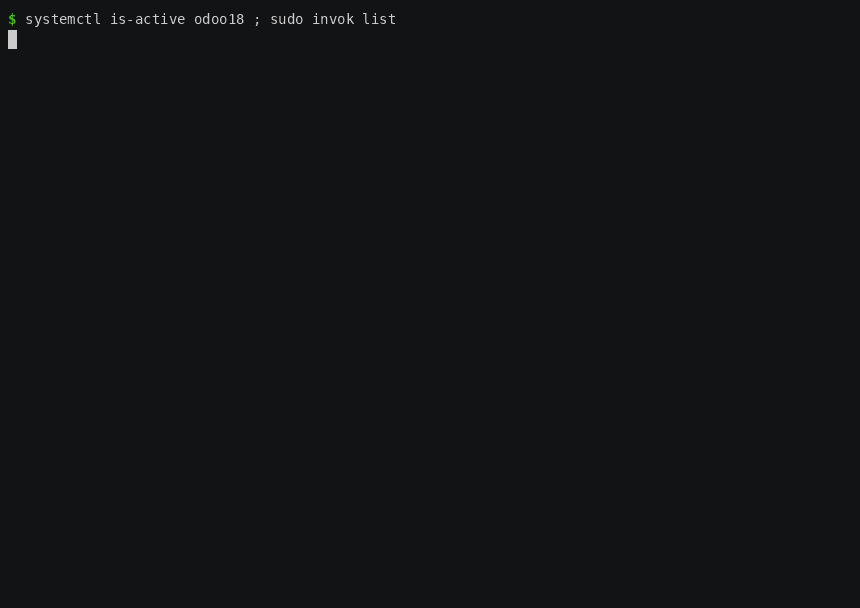
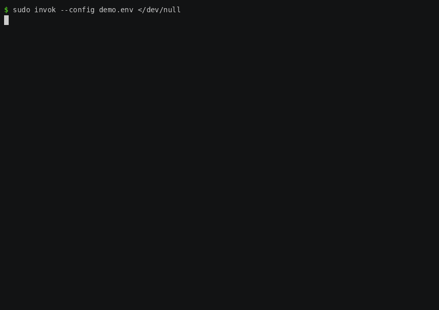

<div align="center">


<h3>Installer for Odoo — with surgical rollback</h3>

<p>
  <em>Either the installation succeeds completely, or the system goes back to exactly what it was.</em>
</p>

<p>
  <a href="LICENSE"></a>
  <a href="https://github.com/Omisen/invok/actions/workflows/test.yml"></a>
  <a href="https://github.com/Omisen/invok/actions/workflows/integration.yml"></a>
  <a href="https://crates.io/crates/invok"></a>
</p>

<p>
  
  
  
</p>


Run it with no arguments and it asks.

<div align="center">
  
  <p><sub>The prompts filled in — version, user, database, port, install directory, master password,
  nginx — and then the installation starting. Everything on screen is the installer's own
  output.</sub></p>
</div>

<p>
  <a href="#install"><b>Install</b></a> ·
  <a href="#configuration"><b>Configuration</b></a> ·
  <a href="#rollback"><b>Rollback</b></a> ·
  <a href="#uninstalling--cleaning-up"><b>Uninstall</b></a> ·
  <a href="#security-notes"><b>Security</b></a> ·
  <a href="https://github.com/Omisen/invok/wiki"><b>Wiki</b></a>
</p>

</div>

---

Installer for **Odoo 16 / 17 / 18 / 19** on Ubuntu ≥ 22.04, Debian ≥ 11 and Fedora ≥ 40, written in
**Rust**, with **transactional rollback**. It sets up the system user, dependencies, PostgreSQL, the
Odoo sources, a virtualenv, the config file, a systemd service, optionally Nginx, and an `odoo` helper
command.

The command is **`invok`**. The `.deb` and `.rpm` packages also install the short alias **`vok`**, a
symlink to the same program: `vok --dry-run` and `invok --dry-run` do exactly the same thing.

<sub><i>Invok — from “invoke”: to call something into being.</i></sub>

> **Independent project.** Not affiliated with Odoo S.A., nor endorsed or sponsored by it. “Odoo” is a
> trademark of Odoo S.A. and is used here only to name the software this tool installs. The installer
> **does not redistribute Odoo code**: it downloads it at runtime from the official
> [`odoo/odoo`](https://github.com/odoo/odoo) repository, onto the target machine.

Full technical documentation — engine, step-by-step reference, rollback model, multi-distro support —
lives in the **[wiki](https://github.com/Omisen/invok/wiki)**.

---

## What sets it apart

- **Surgical, verified rollback** — if a step fails, the steps already executed are undone in reverse
  order, and resources that were **already on the machine** are never touched. It is proven by
  end-to-end tests *and* by a CI job that installs and uninstalls on real machines.
- **One binary, no runtime** — a native executable; git, the package manager, psql and venv stay
  external commands.
- **Three families, no scattered `if`s** — `apt` and `dnf` sit behind two boundaries, and no step
  knows which distribution it runs on.
- **Resumable, and never destructive with itself** — an interrupted installation resumes where it
  stopped; a completed one is never silently overwritten. The `.env` file is parsed **declaratively**,
  never executed as code.
- **Interruptible** — Ctrl-C rolls back and restores the system instead of leaving it half-done.
- **One flow, two modes** — guided (interactive prompts) or non-interactive (`--config`/flags/CI).

---

## Requirements

| Requirement | Detail |
|---|---|
| OS | **Ubuntu ≥ 22.04**, **Debian ≥ 11** or **Fedora ≥ 40** — exercised in CI up to Ubuntu 24.04, Debian 12 and Fedora 44 (full cycle: install, service up, rollback). A newer release is accepted with a warning, not refused |
| Odoo version × OS | 16, 17, 18 and 19 all install on **Ubuntu and Debian**. On **Fedora ≥ 41**, only 17, 18 and 19: see the note below |
| Python | the installer **picks the interpreter**: the system one when Odoo's pins cover it, otherwise the newest interpreter packaged by the distribution that they do cover. On **Fedora ≥ 43** the venv is built on `python3.13`, installed for the occasion and removed by the rollback |
| Privileges | a normal user with `sudo` (not a direct root login) |
| Disk | ≥ 5 GB free (override with `MIN_DISK_GB`) |
| Ports | 8069 free; 80/443 too when using Nginx — unless it is Nginx itself holding them, which is not a conflict |

> **Odoo 16 does not install on Fedora ≥ 41**, and the reason is upstream rather than here. Odoo 16's
> newest `gevent` pin is written for `python_version >= '3.12'` and selects `gevent==24.2.1`, for
> which no prebuilt wheel exists for Python 3.13 — the interpreter every current Fedora ends up on,
> either as the system one (41, 42) or as the one the installer picks (≥ 43). pip then has to compile,
> and the C generated for an older CPython does not survive 3.13's headers. Odoo 17, 18 and 19 pin
> `gevent==24.11.1` for `>= '3.13'`, which does ship a wheel, and install normally.
>
> The installer does not pretend otherwise: if you try, the failure names the interpreter and prints
> the lines that Odoo version declares, instead of leaving you with the compiler's output alone.
> Odoo 16 on **Ubuntu or Debian** is unaffected — it is exercised in CI on both.

`ODOO_HOME` is the **constant** `/opt/odoo` and cannot be overridden.

---

## Install

Same program in every case, and in every case Odoo itself is installed **at runtime**, when you run
the command. The difference that matters is **who compiles**: A, B and C give you a ready-made static
musl binary with no dependencies; D and E build it on your machine.

| | For | |
|---|---|---|
| **A** | any distro, nothing to install | `.tar.gz` |
| **B** | Ubuntu / Debian, command in `PATH` + `vok` alias | `.deb` |
| **C** | Fedora, same | `.rpm` |
| **D** | you already have Rust | `cargo install` |
| **E** | from a clone of this repository | `cargo build` |

> Updates come from the **[Releases](../../releases/latest)** page: every version is there with its
> `sha256`, and you update by downloading again. There is no `apt`/`dnf` repository to add to the
> machine's sources.

The commands below point at **v3.2.0**, the release this README describes. If a newer one exists, find
it on [Releases](../../releases/latest) and change the version in the URLs and file names.

### A — Any distro: prebuilt binary

Two Linux x86_64 variants: `…-musl.tar.gz` is **static** and runs anywhere (recommended);
`…-gnu.tar.gz` is dynamic, for systems with a recent glibc. Each archive ships a `.sha256`.

```bash
curl -fsSL -O https://github.com/Omisen/invok/releases/download/v3.2.0/invok-x86_64-unknown-linux-musl.tar.gz
curl -fsSL -O https://github.com/Omisen/invok/releases/download/v3.2.0/invok-x86_64-unknown-linux-musl.tar.gz.sha256

sha256sum -c invok-x86_64-unknown-linux-musl.tar.gz.sha256   # must say: OK
tar xzf invok-x86_64-unknown-linux-musl.tar.gz

./invok -V              # which version is this
sudo ./invok            # guided (interactive)
sudo ./invok --config production.env --with-nginx   # or non-interactive
```

### B — Ubuntu / Debian: `.deb` package

Puts `invok` in `PATH`, removable with `apt remove invok`. It ships **only** the CLI binary: no
services, no system changes.

```bash
curl -fsSL -O https://github.com/Omisen/invok/releases/download/v3.2.0/invok_3.2.0-1_amd64.deb
curl -fsSL -O https://github.com/Omisen/invok/releases/download/v3.2.0/invok_3.2.0-1_amd64.deb.sha256

sha256sum -c invok_3.2.0-1_amd64.deb.sha256   # must say: OK
sudo apt install ./invok_3.2.0-1_amd64.deb

invok -V                # which version is installed
sudo invok              # now on PATH — `sudo vok` is the same program
```

The package creates `/usr/bin/vok` as a link to `/usr/bin/invok`. If a `/usr/bin/vok` already exists
and is **not** a link, the alias is skipped and the installation says so: someone else's file does not
get overwritten.

### C — Fedora: `.rpm` package

The same binary in the other wrapper. Removable with `sudo dnf remove invok`.

```bash
curl -fsSL -O https://github.com/Omisen/invok/releases/download/v3.2.0/invok-3.2.0-1.x86_64.rpm
curl -fsSL -O https://github.com/Omisen/invok/releases/download/v3.2.0/invok-3.2.0-1.x86_64.rpm.sha256

sha256sum -c invok-3.2.0-1.x86_64.rpm.sha256   # must say: OK
sudo dnf install ./invok-3.2.0-1.x86_64.rpm

invok -V
sudo invok
```

<details>
<summary><b>D — Any distro with Rust: <code>cargo install</code></b></summary>

<br>

The crate is on **[crates.io](https://crates.io/crates/invok)**.

```bash
cargo install invok
sudo "$(command -v invok)"   # cargo installs into ~/.cargo/bin, which root has no PATH entry for
```

This is the path people get wrong, so: `cargo install` **compiles from source** (options A, B and C
hand you the *same* executable ready-made), the binary lands in `~/.cargo/bin/` which is not on root's
`PATH` — a bare `sudo invok` answers `command not found` — and there is no `vok` alias, which only B
and C create. Update with `cargo install invok --force`.

</details>

<details>
<summary><b>E — Any distro: build from source</b></summary>

<br>

```bash
curl --proto '=https' --tlsv1.2 -sSf https://sh.rustup.rs | sh   # Rust toolchain, once
source "$HOME/.cargo/env"

git clone https://github.com/Omisen/invok.git && cd invok
cargo build --release            # → target/release/invok

sudo ./target/release/invok
```

</details>

Run it **via `sudo` from a normal user**: `SUDO_USER` becomes the owner of the `odoo` helper command.
Parameters resolve in this order: **CLI → `.env` → interactive prompt → default**.

---

## Configuration

| Flag | Value | Default |
|---|---|---|
| `--version` | `16` \| `17` \| `18` \| `19` (or `NN.0`) | `18.0` |
| `--instance` | name of this instance — see below | none (the historical names) |
| `--odoo-user` | system user | `odoo` |
| `--db-user` | PostgreSQL role | = `--odoo-user` |
| `--db-password` | password for the DB role | empty → peer authentication |
| `--port` | HTTP port (1–65535) | `8069` |
| `--gevent-port` | longpolling/websocket port | `--port` + 3 (so `8072`) |
| `--db-name` | database name | `odoo` |
| `--install-dir` | install directory (must live under `/opt/odoo`) | `/opt/odoo/odoo<N>` |
| `--admin-passwd` | Odoo master password | `admin` (discouraged) |
| `--with-nginx` | Nginx reverse proxy | off |
| `--server-name` | `server_name` of the Nginx vhost | `_` (catch-all) |
| `--config <FILE>` | load a `.env` file (declarative) | — |
| `--dry-run` | print the plan without changing anything | off |
| `--force` | install even if a manifest exists, archiving it instead of overwriting | off |

Also: `--install-dir`, `--logfile`, `--open-https-port` (opens 443 on the firewall ahead of TLS; it
does **not** configure TLS — legacy alias `--enable-ssl`), `--aggressive-rollback`, and
`-V`/`--installer-version` for the **installer** version (`--version` is Odoo's). `--help` and the
wiki have them all. Subcommands: `invok rollback` (alias `uninstall`) and `invok list`, below; with no
subcommand, the command installs.

```bash
sudo invok --version 17 --with-nginx
sudo invok --with-nginx --server-name '[your-domain.example.com]'
sudo invok --version 18 --db-name odoo --port 8069 --admin-passwd '[YOUR_ADMIN_PASSWORD]'
```

### `--instance`: naming an installation

By default the installer names its artifacts after the Odoo **version**: the unit is `odoo18`, the
sources live in `/opt/odoo/odoo18`, the system user and the database are both `odoo`. That is what
every release so far has written on disk, and passing no `--instance` keeps every one of those names
exactly as it is.

`--instance <name>` names them after the **instance** instead. With `--instance cliente-x`:

| | Without `--instance` | `--instance cliente-x` |
|---|---|---|
| systemd unit | `odoo18` | `odoo-cliente-x` |
| sources and virtualenv | `/opt/odoo/odoo18` | `/opt/odoo/odoo-cliente-x` |
| system user and PostgreSQL role | `odoo` | `odoo-cliente-x` |
| database | `odoo` | `odoo-cliente-x` |
| home, filestore, cache | `/opt/odoo/...` | `/opt/odoo/odoo-cliente-x/...` |
| helper command | `odoo` | `odoo-cliente-x` |

The name must be lowercase letters, digits, `-` and `_`, start with a letter and stay within 26
characters — the intersection of what a systemd unit, a path, a PostgreSQL identifier, an Nginx
`server_name` and a Unix user name each accept. It is checked before anything on the machine is
touched.

The system user and the PostgreSQL role are always given the **same** name, and that is not a
convention: Odoo connects over the local Unix socket, where `pg_hba.conf` usually says `peer` — which
authenticates by operating-system user and ignores the password. A role named differently from the
user would simply be refused. If you decouple them explicitly, the installer says so and lets you
proceed: your `pg_hba.conf` may well be configured for it.

Each instance gets its **own uninstall manifest**: `/var/lib/invok/instances/<name>.json` for a named
one, and `/var/lib/invok/state.json` — where it has always been — for the unnamed one. So a second
instance can be installed alongside the first, and each is undone on its own.

Each instance takes **two** ports: the HTTP one and the longpolling one Odoo's gevent worker binds
at startup. `--port` moves both — `8169` gives `8172` — so a second instance normally needs nothing
else; `--gevent-port` is there for the machine that already has something on that number. The
preflight refuses a port another instance has **recorded**, even when nothing is listening on it
right now: an instance that is merely stopped holds no socket, and the collision would otherwise
surface at the first simultaneous start, naming neither of them.

```bash
sudo invok --instance cliente-x --port 8169    # a second instance (HTTP 8169, longpolling 8172)
sudo invok list                                # what this machine carries
sudo invok rollback --instance cliente-x       # undo just that one
sudo invok rollback --all                      # undo them all, shared artifacts last
```

`invok list` needs root, because the manifests are `0600 root` — a listing that silently came up
empty for lack of privileges would be worse than a refusal. For the same reason a manifest that
exists but cannot be read is reported as a problem rather than skipped.

`rollback` with no `--instance` works when there is exactly one instance; with several it lists them
and stops, rather than choose one for you. The unnamed instance is called `default` when you have to
type it, and for that reason `default` is not accepted as an instance name.

### Removing one instance while the others stay

`/opt/odoo`, the system packages, the PostgreSQL cluster, wkhtmltopdf and the Nginx installation
belong to whichever instance created them. Removing that instance while another is installed would
take the ground out from under a running system, so those artifacts are **left in place** and the
rollback says so:

```
Shared with the instances still installed (default): left in place.
  - prepare-opt-root
  - install-system-dependencies
  - setup-postgres
```

The instance's own artifacts — sources, virtualenv, database, role, config, unit, vhost, helper and,
for a named instance, its system user and home — are removed as always. Its manifest is **kept**: it
is the record of who owns what the others are still using, and `invok list` shows it as `shared only`.

To take everything off, in the right order:

```bash
sudo invok rollback --all
```

Two passes: each instance's own artifacts first, then what they had in common, once nothing is using
it. That ordering is the whole reason `--all` exists as its own flag rather than a loop you write
yourself.

### The `.env` file

With `--config <FILE>` the parameters come from a `KEY=VALUE` file. Unlike the old Bash version (which
`source`d the file — code execution as root), parsing here is **declarative**: `KEY=VALUE` lines, `#`
comments and blank lines ignored, **nothing executed** (a value like `$(...)` stays a literal string).
Unknown keys produce a warning and are ignored.

Recognised keys: `ODOO_VERSION`, `ODOO_INSTANCE`, `ODOO_USER`, `DB_USER`, `DB_PASSWORD`, `ODOO_PORT`,
`ODOO_GEVENT_PORT`, `DB_NAME`,
`ODOO_INSTALL_DIR`, `ODOO_ADMIN_PASSWD`, `ODOO_LOGFILE`, `WITH_NGINX`, `NGINX_SERVER_NAME`,
`NGINX_OPEN_HTTPS_PORT` (legacy alias `NGINX_ENABLE_SSL`). `ODOO_HOME` is constant and ignored.

```bash
# production.env
ODOO_VERSION=18
ODOO_USER=odoo
ODOO_PORT=8069
DB_NAME=odoo
WITH_NGINX=true
# ODOO_ADMIN_PASSWD=...   # do NOT use 'admin' in production
```

> **You write this file.** The repository ships no `production.env`: a `.env` holds the admin and
> database passwords, so `configs/*.env` is git-ignored by design. The only exceptions are the CI
> presets — `configs/ci.env` and `configs/ci-nginx.env`, throwaway files for ephemeral runners — which
> serve as a complete example to copy.

<details>
<summary><b>Environment variables (network tuning)</b></summary>

<br>

Not installation parameters, but knobs for difficult networks, read from the process environment.

| Variable | Default | What it does |
|---|---|---|
| `ODOO_NETWORK_TIMEOUT_SECS` | `300` | Timeout for network operations (Odoo clone, fallback tarball, wkhtmltopdf `.deb` download). On expiry the command is interrupted with a clear error instead of hanging. `0` disables it |
| `GIT_CLONE_RETRIES` | `3` | `git clone` attempts before falling back to the tarball (a timeout consumes one attempt) |
| `PACKAGE_INSTALL_ATTEMPTS` | `3` | attempts at installing the packages when the **mirror** is what failed (`Failed to fetch`, a connection reset). A package that does not exist is not retried: it would answer the same way every time |
| `GIT_DEPTH` | `5` | Shallow clone depth |

`apt-get` and long local operations (DB init, `pip install`, venv creation) have **no** timeout:
cutting them short does more damage than waiting.

</details>

---

## Preview, and life after the installation

`--dry-run` runs the snapshots only (read-only) and prints the **plan**, telling "would act" apart from
"no-op (already present)". Nothing is changed and no state is persisted. It works with or without
`sudo`, but not identically: snapshots *interrogate* the system, and some do it through `sudo`
(PostgreSQL state, installed packages). Without privileges those steps show up as “snapshot
unavailable” and the plan, though true, is incomplete — the installer says so before printing it.

```bash
sudo invok --config production.env --dry-run   # the plan, before anything happens

systemctl status odoo18                  # N = short version, e.g. 18
journalctl -u odoo18 -n 50 --no-pager

odoo status                              # helper command; after: source ~/.bashrc
                                         # start | stop | restart | status | list | logs | dev
```

Each instance gets **its own** helper — `odoo`, `odoo-cliente-x` — and every verb that starts or
stops acts on that instance alone: on a machine with two customers, a helper that could stop the
other one would be a way to take a customer offline by accident. Reading is not touching, though, so
`list` (and `status`, which prints it after its own state) answers from **any** helper: what is
installed here, what is up, and which command drives each.

```
Odoo services on this machine:
   odoo-cliente-x.service           inactive
-> odoo18.service                   active   (this one: odoo)
```

`logs` follows this instance's journal (`logs 500` for more scrollback); Ctrl-C stops reading and
leaves the service running — worth saying, because `dev` is the verb right next to it and that one
does stop it. `dev` opens a shell as the instance's user to run `odoo-bin` by hand; when you leave,
it puts the service back the way it found it. You are asked first — and the answer you get by just
pressing Enter is always "as it was", so an instance that was serving comes back up and one you had
deliberately switched off stays off. If there is no terminal to ask — you closed the window, or the
session was killed — the same rule is applied without asking, which is the case the behaviour exists
for.

```bash
sudo cat /var/log/invok.log              # installer log (post-mortem; survives rollback, by design)
```

---

## Rollback

<div align="center">
  
  <p><sub>The instance is running, then <code>invok rollback</code> undoes all 25 steps in reverse:
  no leftovers, the manifest is consumed, and <code>/opt/odoo</code>, the user and the service are
  gone. The installation happened before the recording; nothing else is edited.</sub></p>
</div>

Before mutating anything, every step records whether what it is about to create **already existed**.
If a step fails, the previous ones are undone **in reverse order** (best-effort, idempotent). The key
guarantee is about **pre-existing resources**, which a rollback never touches:

- an **existing database with the same name** is never dropped (it may hold real data);
- an already-installed **PostgreSQL** stays (stop/disable by default, never purged without the flag);
- an existing **`/opt/odoo`** stays;
- the user's **`~/.bashrc`** comes back **byte for byte** (only our line is removed).

<div align="center">
  
  <p><sub>Two refusals, before anything is touched: an installation already registered — with the
  three ways on — and a port <b>another manifest</b> claims, while nothing is listening on it.</sub></p>
</div>

**Re-running the installer.** A registered installation is never silently overwritten. If the previous
one was **complete**, the installer stops and tells you the three ways on — `--instance <name>
--port <free port>` to add a **second** instance beside it, `invok rollback` to remove it, or
`--force` to install over it, which *archives* the old manifest rather than deleting it. Note that
plainly re-running does not add an instance: an instance is created by **naming** it, on the command
line or with `ODOO_INSTANCE` in a `.env`. If it was
**interrupted** (Ctrl-C, crash, power loss), it resumes where it stopped: steps already executed are
not redone, and the record that those artifacts are **ours** is preserved — which is what lets the
rollback remove them months later. Resuming needs the **same parameters**: with a different database
name the installer stops and says which field does not match.

**Ctrl-C.** A Ctrl-C (or a `kill`/`systemctl stop`) no longer kills the installer: the installation
**rolls itself back**. The interruption takes effect *between* steps — the one in progress is carried
to completion, because stopping an `apt` halfway would leave `dpkg` inconsistent. For most commands
the wait is short: the signal reaches the whole process group, so the one running ends by itself. The
three that talk to the network (the clone, the tarball, the `.deb`) run in a process group of their
own — so that a timeout can kill the *worker* and not just the `sudo` in front of it — and are
therefore finished rather than interrupted; the log says so when it happens, and the wait is bounded
by `ODOO_NETWORK_TIMEOUT_SECS`. A **second Ctrl-C exits immediately** with code 130, leaving the
system half-done by your choice; clean it up with `sudo invok rollback`.

> **From a script, signal the installer only.** “Two Ctrl-C” means *two signals received*. A
> `sudo pkill -INT -f invok` hits **two** processes — the `sudo` and the installer — and so counts as
> the second press: immediate exit, no rollback. Use `sudo pkill -INT -x invok` (`-x` = exact process
> name). From a terminal the problem does not arise.

---

## Uninstalling / cleaning up

```bash
sudo invok rollback --dry-run   # what would be removed, touching nothing
sudo invok rollback             # remove for real (asks for confirmation)
```

`uninstall` is an alias of the same command. It reads the state left by the installation, rebuilds the
steps with **the snapshot taken back then** and runs their undos in reverse order. The same guarantee
holds: only what the installer created is removed. A database that already existed stays where it is —
because the saved snapshot says so, not because of an inspection made at rollback time, which by then
could no longer tell the two cases apart.

| Flag | Value | Default |
|---|---|---|
| `--instance <NAME>` | which instance to undo; `default` is the unnamed one | the only one installed, or a refusal listing them |
| `--all` | every instance, own artifacts first and shared ones last | off |
| `--state <FILE>` | state file to consume | `/var/lib/invok/state.json` (falls back to the historical `/opt/odoo/.installer-state.json`) |
| `--dry-run` | list without mutating (no `sudo` needed) | off |
| `--aggressive-rollback` | also purge PostgreSQL/Nginx installed by us, and the common utilities | off |
| `--yes` / `-y` | skip the confirmation (required with no terminal) | off |

With more than one instance installed, `rollback` on its own **lists them and stops**: it will not
guess which one you meant when the choice is destructive. `--instance` and `--all` are the two ways
to say it out loud, and `--state` cannot be combined with `--instance` — one names a file, the other
names an instance.

On a successful installation the state file **stays on disk**: it is the *uninstall manifest*, the only
record of which artifacts that installation created and which it found already there. Without it
`invok rollback` could not tell the two apart, and could not remove the instance. Do not delete it by
hand. It is removed only after a complete rollback; if something could not be cleaned up the file
stays and the command can be re-run (undos are idempotent).

Three files live **outside** `/opt/odoo`, which is the perimeter the rollback must be able to remove
whole: the manifest `/var/lib/invok/state.json`, the lock `/run/invok.lock` (prevents two concurrent
installations, gone after a reboot) and the log `/var/log/invok.log`. A **named** instance keeps its
manifest in `/var/lib/invok/instances/<name>.json`, for the same reason: one file per instance, so
each is undone on its own.

---

## Security notes

- **Admin password `admin`**: discouraged. Interactively it needs an explicit confirmation; in
  non-interactive mode with `admin_passwd=admin` the installer **stops**. The password never reaches
  the logs or the summary.
- **wkhtmltopdf checksum (TOFU)**: the SHA-256 of the package is verified before installing. Upstream
  publishes no checksums or signatures, so the pins are **manual, trust-on-first-use** and preloaded in
  the source. A download that does not match its pin — or a variant with no pin — is *fail-closed*
  refused, with no bypass.
- **The `odoo` helper is not global**: installed for the installing user only (`~/.local/bin`).
- **TLS is not configured by the installer, deliberately.** The generated Nginx vhost listens on port
  80 only. For HTTPS use `certbot --nginx`, which obtains the certificates and **rewrites the vhost
  itself**, adding the 443 block and the redirect; `--open-https-port` only opens 443 on the firewall
  ahead of that step.

  ```bash
  sudo apt install certbot python3-certbot-nginx
  sudo certbot --nginx -d odoo.example.com
  ```

Two behaviours worth knowing before you deploy — how the Python interpreter is chosen, and the one
visible difference between the two Nginx layouts (on Fedora the default site lives *inside*
`nginx.conf` and is deliberately left alone) — are in the
**[wiki](https://github.com/Omisen/invok/wiki)**. Vulnerability reports: [SECURITY.md](SECURITY.md).

---

## Development

```bash
cargo build
cargo test          # runs without root: the system is behind a mock
cargo clippy --all-targets -- -D warnings
cargo fmt --all -- --check
```

The tests cover every step (snapshot→run→undo round trip), the coordination between steps and the
**end-to-end rollback** (injected failure → final state == initial state; pre-existing resources
untouched). `.github/workflows/test.yml` runs them on every push. They run against a **mock** of the
system, so they prove the logic, not the integration with a real package manager, PostgreSQL and
systemd. That is `.github/workflows/integration.yml`, which really installs Odoo on ephemeral runners
and containers — Ubuntu, Debian, Fedora, with and without Nginx, with a pre-existing `odoo` user, and
with a real `SIGINT` mid-installation — then checks that `invok rollback` leaves the system clean,
package by package. It runs on demand and on `main`/`dev`. The matrix and its declared limits are in
the wiki.

```bash
MODE=full bash scripts/ci/integration-test.sh   # runnable by hand — DESTRUCTIVE: throwaway VMs only
```

Contributions welcome. Run the four commands above before opening a PR, and keep to three rules this
project takes seriously:

1. **Every mutation is reversible.** A new step carries `snapshot`/`run`/`undo` and a `PreState`; if it
   creates something the rollback cannot remove, it is not finished. The `Step` trait is not to be
   modified in order to add a step.
2. **No `.unwrap()`/`.expect()` in production code**: every failure is a `Result` that says *what* and
   *where*.
3. **A test that cannot fail is not a test.** Check that your red case really goes red first.

If the change affects behaviour on one distribution, say so in the PR: the integration CI is where that
shows up.

---

## History and licence

The installer was originally written in **Bash**; those versions are archived at tags
[`v1.0.0`](../../releases/tag/v1.0.0) and [`v1.2.0`](../../releases/tag/v1.2.0). The current version is
a complete **rewrite in Rust** with transactional rollback, and is the only one in this repository.

MIT — see [LICENSE](LICENSE). The published `.tar.gz`, `.deb` and `.rpm` contain **only** the `invok`
binary and a short plain-text guide (`PACKAGE-README`, installed as
`/usr/share/doc/invok/README`): no third-party code is redistributed. Odoo and wkhtmltopdf (both
LGPLv3) are downloaded at runtime from their official sources and remain subject to their own
licences.

This project is independent and is **not affiliated with Odoo S.A.**, nor endorsed by it; “Odoo” is a
trademark of Odoo S.A.

---

<div align="center">

### [→ Technical documentation](https://github.com/Omisen/invok/wiki)

<sub>Engine and the <code>Step</code> trait · step-by-step reference · rollback model ·
multi-distribution support · security</sub>

<br>

<sub>Made for Ubuntu, Debian and Fedora. Independent project — not affiliated with Odoo S.A.</sub>

</div>
